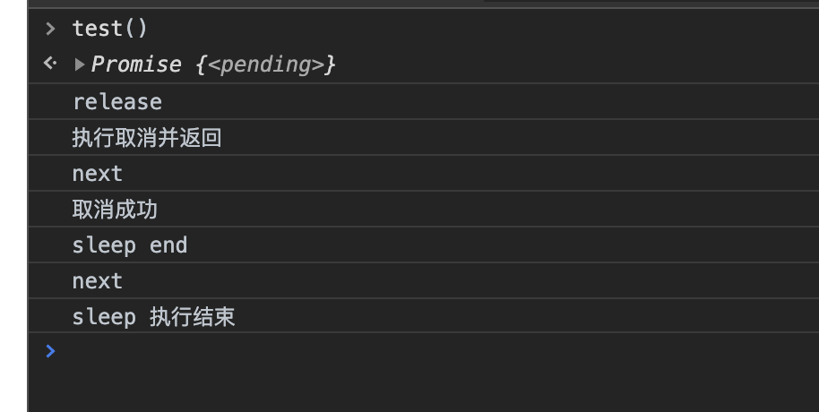

# 2020 年面试经验（一）

## 前言

脱产学习两个月，面试历时两个月，总共四个月，终于上岸，大大小小面了有 10 家公司，现在把面试中遇到的问题，总结一下，暂时画一个句号吧，以下是我这段时间遇到的面试题和感受

面试的机会大多是通过朋友内推，在 boss 上投简历得到的也有，但是大部分是已读未回 🤨，一定程度上可能是疫情的原因，很多企业的市场不是很好吧

因为疫情的原因，基本都是远程面试，面试的大致流程如下：

笔试 ----> 技术面（三次） ----> hr 面 ----> 或许还有 vp 面

其中，技术面，大多数的情况是

- 一面：多是基础问题
- 二面：结合以往项目，难度增加，或者有实际场景的问题
- 三面：主要是以往项目的问题，还有个人的性格，格局，视野

然后，我得到最多的一个经验就是，回答问题的时候不能是问一答一，要在问题的基础上进行延伸和扩展，最好可以深入到底层原理，尽量把自己知道的都倒出来，有机会的话，尽量把问题往自己擅长的方向引，但是因为本人是个内向不会说话的傻憨憨，所以只是实实地道出知道的，相关的内容 😝

当然，在面试之前一定要做好准备，对自己有个明确的定位，梳理自己的知识网络，刷刷常见的面试题什么的

## 面试题目

### 笔试

#### 🤓

##### 问题 1: ['1','2','3'].map(parseInt)

答：[1,NaN,NaN]

> parseInt(string, radix) 将一个字符串 string 转换为 radix 进制的整数， radix 为介于 2-36 之间的数。

如果 radix 是 undefined、0 或未指定的，JavaScript 会假定以下情况：

- 如果输入的 string 以 "0x"或 "0x"（一个 0，后面是小写或大写的 X）开头，那么 radix 被假定为 16，字符串的其余部分被解析为十六进制数。
- 如果输入的 string 以 "0"（0）开头， radix 被假定为 8（八进制）或 10（十进制）。具体选择哪一个 radix 取决于实现。ECMAScript 5 澄清了应该使用 10 (十进制)，但不是所有的浏览器都支持。因此，在使用 parseInt 时，一定要指定一个 radix。
- 如果输入的 string 以任何其他值开头， radix 是 10 (十进制)。

> ```js
> arr.map(function callback(currentValue[, index[, array]]) {
>   // Return element for new_array
> }[, thisArg])
> ```

所以依次执行的是

- `parseInt('1',0) ==> 1`
- `parseInt('2',1) ==> radix 为介于2-36之间的数 所以NaN`
- `parseInt('2',2) ==> 二进制不会有2，所以NaN`

##### 问题 2:拍平数组，[1,[2,3],4] ==> [1,2,3,4]

答：

- 方法 1:concat 递归实现

```js
function fn(arr) {
  let arr1 = [];
  arr.forEach((val) => {
    if (val instanceof Array) {
      arr1 = arr1.concat(fn(val));
    } else {
      arr1.push(val);
    }
  });
  return arr1;
}
```

- 方法 2:reduce

```js
function fn(arr) {
  return arr.reduce((prev, cur) => {
    return prev.concat(Array.isArray(cur) ? fn(cur) : cur);
  }, []);
}
```

- 方法 3:flat

```js
arr.flat(Infinity);
```

- 方法 4:扩展运算符

```js
function fn(arr) {
  let arr1 = [];
  let bStop = true;
  arr.forEach((val) => {
    if (Array.isArray(val)) {
      arr1.push(...val);
      bStop = false;
    } else {
      arr1.push(val);
    }
  });
  if (bStop) {
    return arr1;
  }
  return fn(arr1);
}
```

- 方法 5:toString

```js
let arr1 = arr.toString().split(",");
```

这个方法存在问题

1. 数组的每一项变成了 string 类型
2. 如果数组中存在，例如:`{}`,转换后变成`"{}"`
3. 也就是说会改变数组中原本的值

- 方法 6:apply

```js
function flatten(arr) {
  while (arr.some((item) => Array.isArray(item))) {
    arr = [].concat.apply([], arr);
  }
  return arr;
}
```

##### 问题 3

```js
var x = 1;
function a() {
  this.x = 2;
  return {
    x: 3,
  };
}

var b = new a();
console.log(b.x);

function a() {
  this.x = 2;
}

var b = new a();
console.log(b.x);
```

答：3，2

new 操作符做了这些事:

- 它创建了一个全新的对象。
- 它会被执⾏[[prototype]](也就是 **proto** )链接。
- 它使 this 指向新创建的对象。
- 通过 new 创建的每个对象将最终被 [[prototype]]链接到这个函数的 prototype 对象上。
- 如果函数没有返回对象类型，那么表达式中的函数调⽤用将返回该对象引⽤用。

  ```js
  function New(func) {
    var res = {};
    if (func.prototype !== null) {
      res.__proto__ = func.prototype;
    }
    var ret = func.apply(res, Array.prototype.slice.call(arguments, 1));
    if (
      (typeof ret === "object" || typeof ret === "function") &&
      ret !== null
    ) {
      return ret;
    }
    return res;
  }
  ```

##### 问题 4: 两数组交集，并集

答：

```js
// 交集
let _arr2Set = new Set(arr2);
let intersection = arr1.filter((item) => _arr2Set.has(item));

// 并集
let union = Array.from(new Set([...arr1, ...arr2]));
```

当然,上述结果的前提是，每个数字在结果中出现一次，也就是说，以交集为例

```txt
输入：nums1 = [1,2,2,1], nums2 = [2,2]
输出：[2]
而不是：[2,2]
```

如果是第二种输出结果，可以是

1. 用哈希表存储每个数字出现的次数。对于一个数字，其在交集中出现的次数等于该数字在两个数组中出现次数的最小值。时间复杂度：O(m+n)，空间复杂度：O(min(m,n))
2. 首先对两个数组进行排序，然后使用两个指针遍历两个数组。时间复杂度：O(mlogm + nlogn)，空间复杂度：O(min(m,n))

##### 问题 5:浅拷贝，深拷贝

答：详见我的另一篇博客[浅拷贝与深拷贝](../../acticle/xuexibiji/基础js/浅拷贝与深拷贝.md)

##### 问题 6

1. 请实现如下函数

```js
function sleep(timeout: number): Promise<void> {
  throw new Error("Not implemented");
}
```

2. 请修改上述函数的接口和实现，让该函数支持取消。也就是说，可以在 sleep 没有结束前，promise 提前 resolve

以下两题非必答

3. 请为 2 中实现的函数提供几组单元测试。示意即可，不需要使用什么单元测试框架类库
4. 如何证明 2 中实现的函数不会内存泄露

答：

```js
class cancelSleep {
  constructor() {
    this.tasks = null;
    this.timer = null;
  }
  sleep(timeout) {
    return new Promise(async (succ) => {
      this.task = succ; //记录sleep的任务，用于被取消时
      this.timer = setTimeout(() => {
        succ();
        // clearTimeout(this.timer)
        this.task = null;
        console.log("sleep end");
      }, timeout);
    });
  }
  release() {
    console.log("release");
    this.task && this.task();
    // 取消延时内操作，并使timer和task被回收
    clearTimeout(this.timer);
    this.task = null;
  }
}

// 模拟单元测试，检查consoleLog结果
let lastLog = null;
function listenLog() {
  let _consoleLog = console.log;
  console.log = function () {
    _consoleLog.apply(console, arguments);
    lastLog = arguments[0];
  };
}
listenLog();

//单元测试
async function test() {
  let process = new cancelSleep();
  async function todosleep() {
    await process.sleep(1000);
    console.log("next");
  }
  // sleep 1000 ，500后取消
  await new Promise((succ) => {
    todosleep();
    setTimeout(() => {
      process.release();
      //断言
      if (lastLog == "release") {
        console.log("执行取消并返回");
        lastLog = null;
      }
      setTimeout(() => {
        //断言
        if (lastLog == "next") {
          console.log("取消成功");
        }
        succ();
      }, 0);
    }, 500);
  });
  //sleep 1000 不取消
  await new Promise((succ) => {
    todosleep();
    setTimeout(() => {
      //断言
      if (lastLog == "next") {
        console.log("sleep 执行结束");
        lastLog = null;
      }
      succ();
    }, 1000);
  });

  process = null;
}
```




### 口述题

这里我将以 **js 基础**、**vue**、**性能/网络/其他** 、**主观题** 为分类进行整理

#### js 基础

##### 问题 1:模块化

答：简述模块化的发展过程

- 以文件为单位，立刻执行函数 `(function(){})()`,很多时候文件最开始加入一个`;`,具体原因不是很清楚，我猜是因为使在打包时，多个文件合并，告知编译器之前的语句结束，这是新的语句开始，减少出错的概率
- 有了 node 以后，出现 CommonJS 的规范，因为 node 对于本地文件 io 的处理优势，同步加载模块
- 从 CommonJS 规范延伸出来 AMD（依赖前置，代表 RequireJS），CMD（依赖就近，代表 SeaJS）
- UMD 根据宿主环境，兼容 AMD 和 CMD

  ```js
  ((root, factory) => {
    if (typeof define === "function" && define.amd) {
      //AMD
      define(["jquery"], factory);
    } else if (typeof exports === "object") {
      //CommonJS
      var $ = requie("jquery");
      module.exports = factory($);
    } else {
      root.testModule = factory(root.jQuery);
    }
  })(this, ($) => {
    //todo
  });
  ```

- es6 的出现，大大方面了我们模块化的开发，通过`export/import`对模块进行导出导入的

其他详见我的另一篇博客[模块化](../../acticle/xuexibiji/基础js/模块化.md)

##### 问题 2:跨域

答：在网上看到一篇有趣的文章，可以很好的帮助我们理解跨域的问题[因为一个跨域请求，我差点丢了饭碗](https://baijiahao.baidu.com/s?id=1668163943392153127&wfr=spider&for=pc)

我在这里简单描述一下几个要点吧

- 源于浏览器的同源策略，是浏览器最核心也最基本的安全功能
- 解决方法

  - jsonp，原理以及 jsonp 的实现

    ```js
    // 生成查询url参数
    var util = {
      toQueryurl: function (o) {
        var arr = [];
        for (var i in o) {
          arr.push(encodeURIComponent(i) + "=" + encodeURIComponent(o[i]));
        }
        return arr.join("&");
      },
    };

    var url = "http://xxxx/xxxx";
    var page = 1;
    var data = {
      pg: page,
    };

    function jsonp(params) {
      var callbackName = "json_" + ~~(Math.random() * 100); // 随机生成回调函数名称
      params.data.callback = callbackName; //注意
      var script = document.createElement("script");
      var flag = params.url.indexOf("?") > -1 ? "&" : "?";
      var queryUrl = params.url + flag + util.toQueryurl(params.data);
      var head = document.getElementsByTagName("head")[0];
      head.appendChild(script);
      script.src = queryUrl;
      //回调函数要接口返回后执行
      window[callbackName] = function (json) {
        window[callbackName] = null;
        clearTimeout(script.timer);
        head.removeChild(script);
        params.success && params.success(json);
      };

      //超时处理
      if (params.timer) {
        script.timer = setTimeout(function () {
          window[callbackName] = null;
          head.removeChild(script);
          params &&
            params.error({
              message: "网络超时",
            });
        }, params.timer);
      }
    }

    // 调用实现
    jsonp({
      url: url,
      data: data,
      success: function (res) {
        console.log(res);
        if (res.status == 1) {
          console.log("接口响应成功");
        }
      },
      error: function (error) {
        console.log(error);
      },
      timer: 5000,
    });
    ```

  在服务端的处理，需要输出 `callback(${data})`

  - cors 跨域资源分享（Cross-Origin Resource Sharing,

    - 服务器端设置 Access-Control-Allow-Origin,
    - 带 cookie 跨域请求：前后端都需要进行设置

      ```js
      // 前端设置是否带cookie
      xhr.withCredentials = true;

      //后端
      // 允许前端带认证cookie：启用此项后，上面的域名不能为'*'，必须指定具体的域名，否则浏览器会提示
      response.setHeader("Access-Control-Allow-Credentials", "true");

      // 提示OPTIONS预检时，后端需要设置的两个常用自定义头
      response.setHeader(
        "Access-Control-Allow-Headers",
        "Content-Type,X-Requested-With"
      );
      ```

    - 当复杂请求时，会发出 OPTIONS 预检
    - 与 jsonp 相比较
      - jsonp 只能发 get 请求，发送数据量有限（浏览器自身行为限制），cors 无限制（这里可以延伸一些到 get 和 post 的区别）
      - JSONP 没有兼容问题，cors 有兼容问题,只有 ie10 及以上才支持
      - JSONP 发送的不是 ajax 请求，是模拟`script`标签，CORS 发送的是真正的 ajax 请求

  - document.domain + iframe（只有在主域相同的时候才能使用该方法）
  - window.name + iframe
  - postMessage

- 非同源限制
  - 无法读取非同源网页的 Cookie、LocalStorage 和 IndexedDB
  - 无法接触非同源网页的 DOM
  - 无法向非同源地址发送 AJAX 请求

##### 问题 3: for...in 和 for...of 的区别

答：详见我的另一篇博客[比较 for、forEach、for...in 迭代和 for...of](../../acticle/xuexibiji/基础js/for.md)

##### 问题 4: css 定位

答：

- `absolute` 生成绝对定位的元素，相对于 static 定位以外的第一个父元素进行定位。元素的位置通过 "left", "top", "right" 以及 "bottom" 属性进行规定。
- `fixed` 生成固定定位的元素，相对于浏览器窗口进行定位。元素的位置通过 "left", "top", "right" 以及 "bottom" 属性进行规定。
- `relative`生成相对定位的元素，相对于其正常位置进行定位。因此，"left:20" 会向元素的 LEFT 位置添加 20 像素。
- `static` 默认值。没有定位，元素出现在正常的流中（忽略 top, bottom, left, right 或者 z-index 声明）。
- `sticky` 粘性定位，该定位基于用户滚动的位置。它的行为就像 position:relative; 而当页面滚动超出目标区域时，它的表现就像 position:fixed;，它会固定在目标位置。注意: Internet Explorer, Edge 15 及更早 IE 版本不支持 sticky 定位。 Safari 需要使用 -webkit- prefix。
- `inherit` 规定应该从父元素继承 position 属性的值。
- `initial` 设置该属性为默认值

##### 问题 5: 回流和重绘

答：

- html 加载时发生了什么
  - HTML 代码解析成 1 个 DOM 树
  - 所有样式(用户定义的 CSS 和用户代理)解析成样式结构体
  - DOM Tree 和样式结构体组合后构建 render tree
  - 由于浏览器使用流式布局，对 Render Tree 的计算通常只需要遍历一次就可以完成，但 table 及其内部元素除外，他们可能需要多次计算，通常要花 3 倍于同等元素的时间，这也是为什么要避免使用 table 布局的原因之一。
- 什么是回流
  - 当 render tree 中的一部分(或全部)因为元素的规模尺寸，布局，隐藏等改变而需要重新构建。这就称为**回流(reflow)**
  - 在回流的时候，浏览器会使渲染树中受到影响的部分失效，并重新构造这部分渲染树，完成回流后，浏览器会重新绘制受影响的部分到屏幕中，该过程成为**重绘**。
- 什么是重绘
  - 当 render tree 中的一些元素需要更新属性，而这些属性只是影响元素的外观，风格，而不会影响布局的
- 区别
  - 回流必将引起重绘，而重绘不一定会引起回流
  - 当页面布局和几何属性改变时就需要回流
- 优化
  - 浏览器优化
    - 现代浏览器大多都是通过队列机制来批量更新布局，浏览器会把修改操作放在队列中，至少一个浏览器刷新（即 16.6ms）才会清空队列，但当你获取布局信息的时候，队列中可能有会影响这些属性或方法返回值的操作，即使没有，浏览器也会强制清空队列，触发回流与重绘来确保返回正确的值。
  - 避免使用 offsetTop、offsetLeft、offsetWidth、offsetHeight、scrollTop、scrollLeft、scrollWidth、scrollHeight、clientTop、clientLeft、clientWidth、clientHeight、getComputedStyle()、getBoundingClientRect
  - 批量修改 DOM 或者样式`document.createDocumentFragment`
  - 对于复杂动画效果,使用绝对定位让其脱离文档流
  - css3 硬件加速（GPU 加速）
    - 为太多元素使用 css3 硬件加速，会导致内存占用较大，会有性能问题。
    - 在 GPU 渲染字体会导致抗锯齿无效,因此如果你不在动画结束的时候关闭硬件加速，会产生字体模糊。

##### 问题 6: 数据乱序

答：

- 方法 1: `array.sort(()=>(Math.floor(Math.random()*2)*2-1))`

  存在问题：末尾的数字为大数的概率较大，开始的数字为小数的概率较大。

  原因大概是：

  - 在 Chrome v8 引擎源码中，处理 sort 方法时，使用了插入排序和快速排序两种方案。当目标数组长度小于 10 时，使用插入排序；反之，使用快速排序和插入排序的混合排序。
  - 理想的方案是数组中每两个元素都要进行比较，这个比较有 50%的交换位置概率。而在插入排序的算法中，当待排序元素跟有序元素进行比较时，一旦确定了位置，就不会再跟位置前面的有序元素进行比较，所以就乱序的不彻底。

- 方法 2:先从数组末尾开始，选取最后一个元素，与数组中随机一个位置的元素交换位置；

  ```js
  function shuffle(a) {
    for (let i = a.length; i; i--) {
      let j = Math.floor(Math.random() * i);
      [a[i - 1], a[j]] = [a[j], a[i - 1]];
    }
    return a;
  }
  ```

##### 问题 7: 输入有序递增的二维数组，[[1,4,7],[2,5,6],[3,8,9]] => [1,2,3,4,...]

答：归并排序

```js
function fn(arr) {
  let ret = arr[0];
  for (let i = 1, len = arr.length; i < len; i++) {
    ret = sort(ret, arr[i]);
  }
  return ret;
}
function sort(arr1, arr2) {
  let ret = [];
  let i = (j = 0);
  while (arr1[i] && arr2[j]) {
    if (arr1[i] < arr2[j]) {
      ret.push(arr1[i]);
      i++;
    } else {
      ret.push(arr2[j]);
      j++;
    }
  }
  if (i < arr1.length) {
    for (; i < arr1.length; i++) {
      ret.push(arr1[i]);
    }
  }
  if (j < arr2.length) {
    for (; j < arr2.length; j++) {
      ret.push(arr2[j]);
    }
  }
  return ret;
}
```

##### 问题 8: 一个数组，输出和为 target 的索引值

答：

```js
var twoSum = function (nums, target) {
  let map = new Map();
  for (let i = 0, len = nums.length; i < len; i++) {
    const diff = target - nums[i];
    if (map.has(diff)) {
      return [map.get(diff), i];
    }
    map.set(nums[i], i);
  }
};
```

时间复杂度 O(n),空间复杂度 O(n)
map.get 的复杂度是 O(1)

##### 问题 9: 一个数组，有一个数的个数占有一半多，输出这个数

答：

```js
var majorityElement = function (nums) {
  let ret = nums[0];
  let count = 1;
  for (let i = 1, len = nums.length; i < len; i++) {
    if (nums[i] === ret) {
      count++;
    } else {
      count--;
    }
    if (count < 0) {
      ret = nums[i];
      count = 1;
    }
  }
  return ret;
};
```

此方法只用于这个数的个数大于一半，如果正好等于一半，不能得出正确结果

其他方法

- 哈希表
- 如果将数组 nums 中的所有元素按照单调递增或单调递减的顺序排序，那么下标为 n/2 的元素（下标从 0 开始）一定是众数。

##### 问题 10: 数字千分位

答：

- 方法一：正则匹配

```js
(num + "").replace(/(\d{1,3})(?=(\d{3})+(?:$|\.))/g, "$1,");
```

- 方法二：浏览器本地方法

```js
num.toLocaleString();
```

- 方法三：

```js
/**
 * 将数值四舍五入后格式化.
 *
 * @param num 数值(Number或者String)
 * @param cent 要保留的小数位(Number)
 * @param isThousand 是否需要千分位 0:不需要,1:需要(数值类型);
 * @return 格式的字符串,如'1,234,567.45'
 * @type String
 */
function formatNumber(num, cent, isThousand) {
  num = num.toString().replace(/\$|\,/g, "");

  // 检查传入数值为数值类型
  if (isNaN(num)) num = "0";

  // 获取符号(正/负数)
  sign = num == (num = Math.abs(num));

  num = Math.floor(num * Math.pow(10, cent) + 0.50000000001); // 把指定的小数位先转换成整数.多余的小数位四舍五入
  cents = num % Math.pow(10, cent); // 求出小数位数值
  num = Math.floor(num / Math.pow(10, cent)).toString(); // 求出整数位数值
  cents = cents.toString(); // 把小数位转换成字符串,以便求小数位长度

  // 补足小数位到指定的位数
  while (cents.length < cent) cents = "0" + cents;

  if (isThousand) {
    // 对整数部分进行千分位格式化.
    for (var i = 0; i < Math.floor((num.length - (1 + i)) / 3); i++)
      num =
        num.substring(0, num.length - (4 * i + 3)) +
        "," +
        num.substring(num.length - (4 * i + 3));
  }

  if (cent > 0) return (sign ? "" : "-") + num + "." + cents;
  else return (sign ? "" : "-") + num;
}
```

- 方法四：利用 while 循环拼接字符串每隔 3 个数字加一个分隔符

```js
var result = "",
  index = 0,
  len = str.length - 1;
while (len >= 0) {
  index % 3 === 0 && index !== 0
    ? (result += "," + str[len])
    : (result += str[len]);
  len--;
  index++;
}
result = result.split("").reverse().join("");
```

- 方法五：利用reduce

```js
var str = num+'';
return str.split("").reverse().reduce((prev, next, index) => {
  return ((index % 3) ? next : (next + ',')) + prev;
})
```
